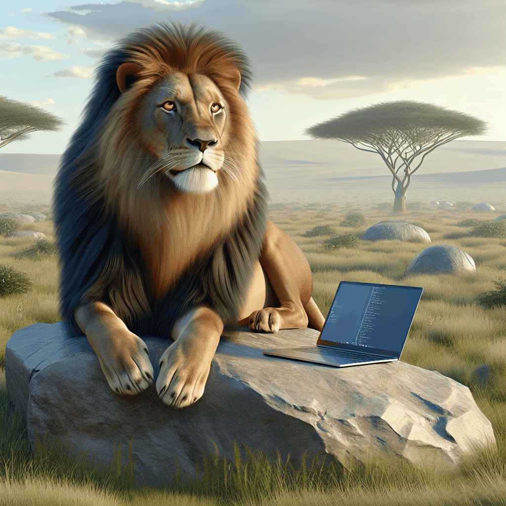
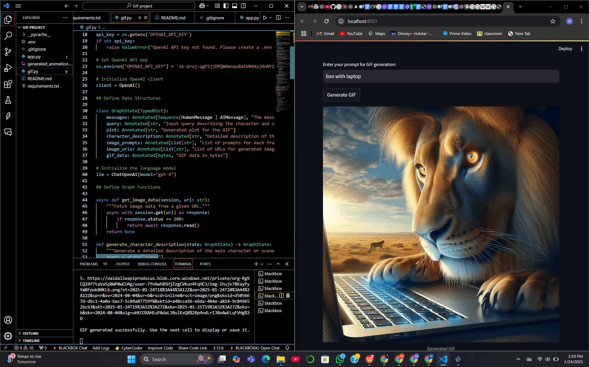
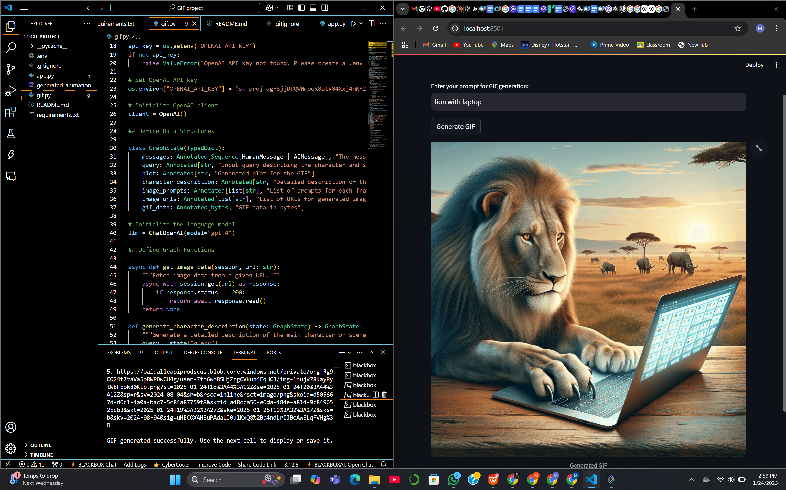
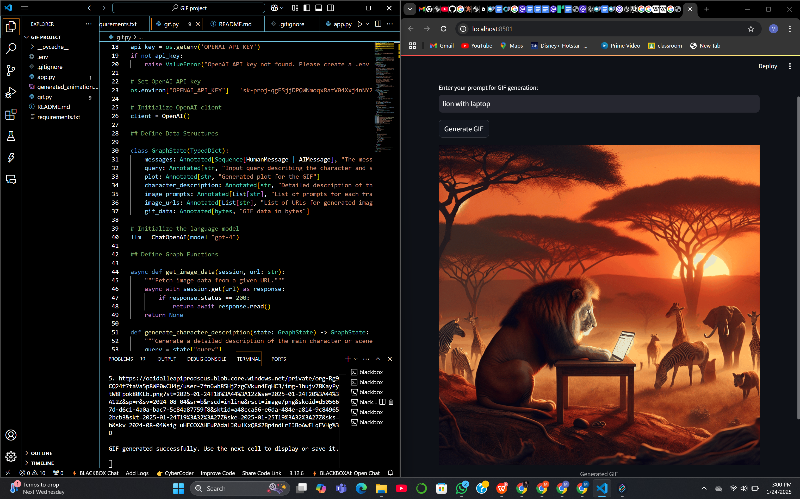

# GIF Animation Generator

## Overview
This project demonstrates the creation of a GIF animation generator that leverages the power of large language models (LLMs) and image generation AI. By combining LangGraph for workflow management, GPT-4 for text generation, and DALL-E for image creation, we've developed a system that can produce custom GIF animations based on user prompts.

## Key Components
- **LangGraph**: Orchestrates the overall workflow, managing the flow of data between different stages of the process.
- **GPT-4 (via LangChain)**: Generates detailed descriptions, plots, and image prompts based on the initial user query.
- **DALL-E 3**: Creates high-quality images based on the generated prompts.
- **Python Imaging Library (PIL)**: Assembles the individual images into a GIF animation.
- **Streamlit**: Provides a user-friendly interface for generating GIFs based on user input.

## Setup
1. Clone the repository:
   ```
   git clone <repository-url>
   cd <repository-directory>
   ```

2. Install the required packages:
   ```
   pip install -r requirements.txt
   ```

3. Create a `.env` file in the root directory with your OpenAI API key:
   ```
   OPENAI_API_KEY='your_api_key_here'
   ```

## Running the Application
To run the Streamlit application, use the following command:
```
streamlit run app.py
```

## Usage
- Enter your prompt in the input box and click "Generate GIF".
- The generated GIF will be displayed below the input box.

## Generated GIF





## License
This project is licensed under the MIT License.
